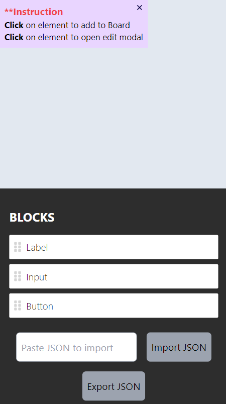
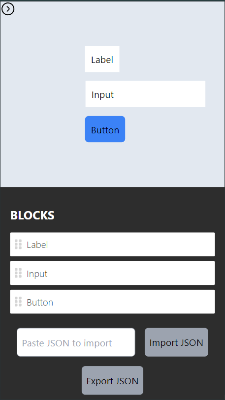
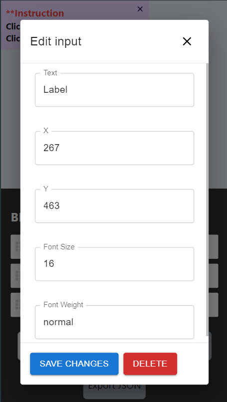
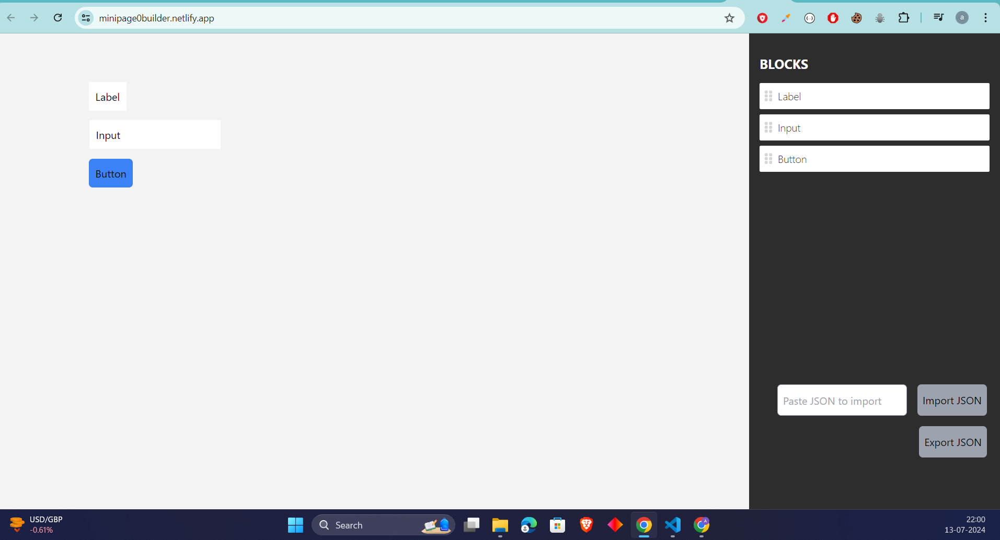
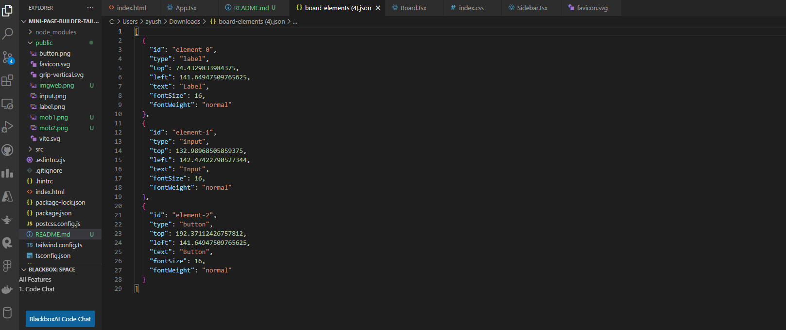
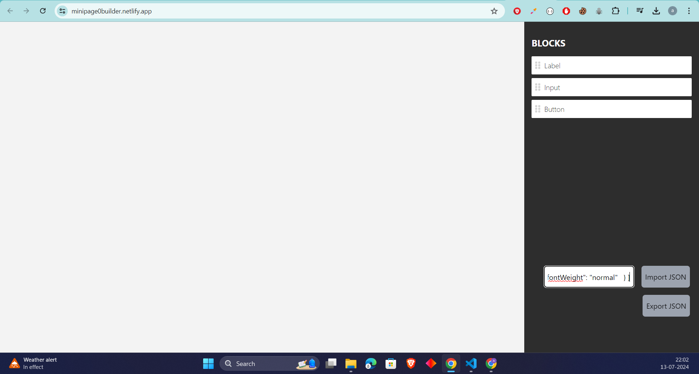
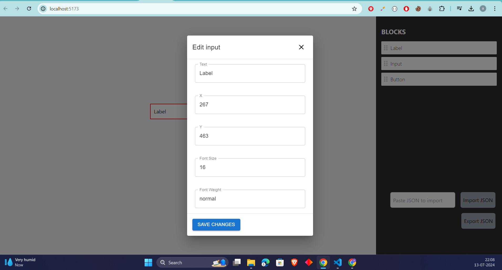

# MINI PAGE BUILDER

## Live Link 
https://minipage0builder.netlify.app/

## Images 
<div className="flex flex-row justify-between gap-6">


</div>





# Exported JSON



# IMPORT JSON




# Edit Modal




## Overview
This project is made with React.JS, TailwindCSS, TypeScript. It has a Sidebar and a Board you can create a form element using this tool by simply drag and drop functionality. 


## Features

- Drag and drop elements from the sidebar onto the board.
- Edit the properties of each element using a modal.
- Save changes automatically to local storage.
- Delete elements from the board.
- Responsive design for mobile devices.


## Getting Started

Follow these steps to run the project locally:

1. Clone the repository:

   ```bash
   git clone https://github.com/Akayush-17/Mini-Page-Builder.git
   cd Mini-Page-Builder
   run npm i
   run npm run dev to start 

